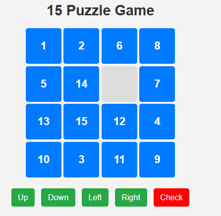
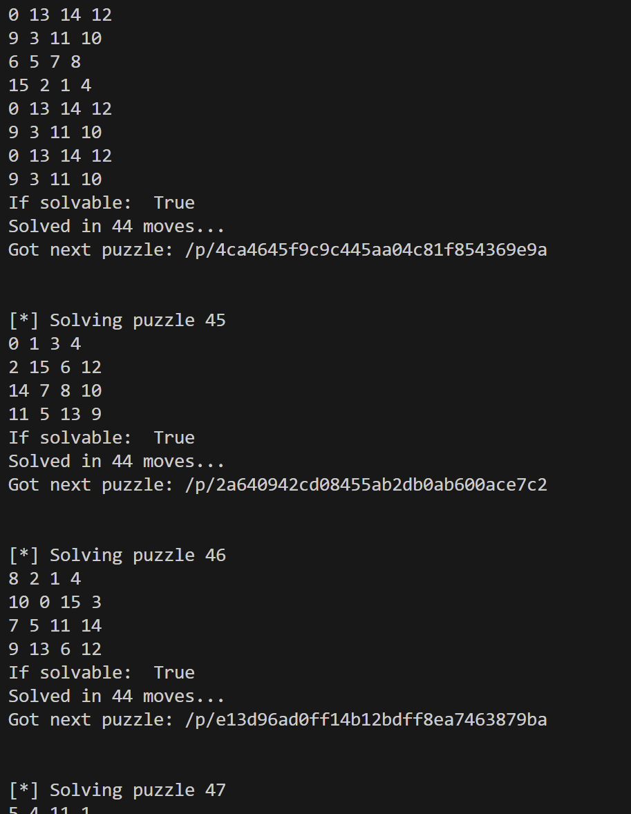
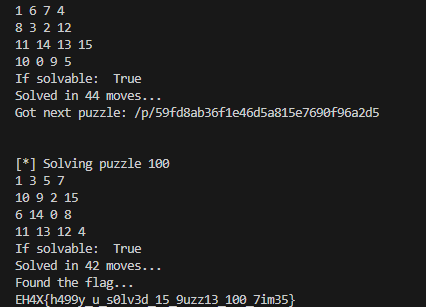

# 15_puzzle.md



해당 문제는 퍼즐을 맞추기만 하면 되는 문제이다.
1~15까지의 숫자를 순서대로 배열하고 요청하면 정답 처리됨과 동시에 다음 퍼즐 문제로 넘어간다.

문제는 퍼즐이 거의 100개일 만큼 좀 많다는건데 당연히 자동화 스크립트로 해결해줘야 한다.

15퍼즐을 풀기 위해선 A(A-star) 알고리즘을 사용해주면 된다.
아래는 Full Exploit 코드이다.

```
# solve.py
import requests
from bs4 import BeautifulSoup
from utils import get_moves
import base64

chall = "http://localhost:5000" # challenge url goes here

home_html = requests.get(chall).text

soup = BeautifulSoup(home_html, 'html.parser')

puzzle_link = soup.a.get("href")

i = 1

while True:
    puzzle_soup = BeautifulSoup(requests.get(chall+puzzle_link).text, 'html.parser')

    # initially the array of puzzle loads in script tag
    puzzle = str(puzzle_soup.find("script")).split("\n")[1]

    # evaluate string array from script to python list
    puzzle = eval(puzzle[puzzle.find("["):-1])

    print(f"[*] Solving puzzle {i}")

    for row in puzzle:
        print(" ".join([str(x) for x in row]))

    # Our algo needs a hashable type tuble convert puzzle to tuple
    puzzle = tuple(tuple(row) for row in puzzle)

    solution_moves = get_moves(puzzle)

    print(f"Solved in {len(solution_moves)} moves...")

    r = requests.post(chall+puzzle_link+"/check", json={ "movements": solution_moves }).json()

    if r["solved"] == True:
        puzzle_link = r["next_puzzle"] # update puzzle link

        if not r["next_puzzle"].startswith("/p"):
            print("Found the flag...")
            print(base64.b64decode(requests.get(chall+r["next_puzzle"]).headers["Hmm"]).decode())
            break
        print(f"Got next puzzle: {r["next_puzzle"]}")
    else:
        continue

    print("\n")
    i += 1


```

```
# utils.py
import heapq

GOAL_STATE = (
    (1, 2, 3, 4),
    (5, 6, 7, 8),
    (9, 10, 11, 12),
    (13, 14, 15, 0)
)

def manhattan_distance(state, goal):
    distance = 0
    for i in range(4):
        for j in range(4):
            if state[i][j] != 0:
                goal_position = [(goal[row][col] == state[i][j]) for row in range(4) for col in range(4)]
                goal_row, goal_col = divmod(goal_position.index(True), 4)
                distance += abs(goal_row - i) + abs(goal_col - j)
    return distance


def get_neighbors(state):
    neighbors = []
    blank_pos = [(ix, iy) for ix, row in enumerate(state) for iy, i in enumerate(row) if i == 0][0]
    x, y = blank_pos
    to_move = [[-1, 0], [1, 0], [0, -1], [0, 1]]

    for dx, dy in to_move:
        new_x = x + dx
        new_y = y + dy
        if 0 <= new_x < 4 and 0 <= new_y < 4:
            new_state = [list(row) for row in state]
            new_state[x][y], new_state[new_x][new_y] = new_state[new_x][new_y], new_state[x][y]
            neighbors.append(((tuple(tuple(row) for row in new_state), [dx, dy])))

    return neighbors

def a_star(start, goal):
    priority_queue = []
    heapq.heappush(priority_queue, (0, start, []))
    came_from = {start: None}
    cost_so_far = {start: 0}

    while priority_queue:
        _, current, moves = heapq.heappop(priority_queue)

        if current == goal:
            path = []
            while current:
                path.append(current)
                current = came_from[current]
            return path[::-1], moves

        for neighbor, move in get_neighbors(current):
            new_cost = cost_so_far[current] + 1
            if neighbor not in cost_so_far or new_cost < cost_so_far[neighbor]:
                cost_so_far[neighbor] = new_cost
                priority = new_cost + manhattan_distance(neighbor, goal)
                heapq.heappush(priority_queue, (priority, neighbor, moves+[move]))
                came_from[neighbor] = current
    return None


def is_solvable(tiles):
    flattened = [tile for row in tiles for tile in row]
    inv_count = sum(
        1
        for i in range(len(flattened))
        for j in range(i + 1, len(flattened))
        if flattened[i] and flattened[j] and flattened[i] > flattened[j]
    )
    empty_row = next(i for i, row in enumerate(tiles) if 0 in row)
    return (inv_count % 2 == 0) if empty_row % 2 else (inv_count % 2 == 1)


def get_moves(start_state):
    print("If solvable: ", is_solvable(start_state))
    solution_path, moves = a_star(start_state, GOAL_STATE)

    return moves

```

BeautifulSoup을 사용해 문제 퍼즐과 다음 퍼즐 링크를 가져온다.
가져온 문제 배열을 사용해 A 알고리즘을 활용하여 퍼즐을 풀고 다음 문제로 넘어간다.



돌리고 좀 많이 기다리면 퍼즐을 100개 풀고 flag를 찾는다.



`FLAG : EH4X{h499y_u_s0lv3d_15_9uzz13_100_7im35}`
