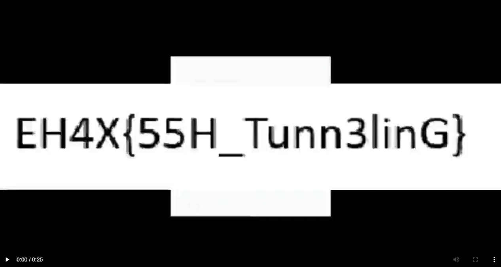

# quandale_dingle

SSH 문제이다.

먼저, pem 파일을 다운받고 해당 명령어로 ssh에 접속한다.

`ssh -i quandale.pem quandale@20.244.95.158`

그러면 shell에 접속이 가능한데 해당 shell에선 아무 명령어도 실행시키지 못한다. 즉, 제한된 셸이다.
때문에 다른 방법을 사용해야 하는데 해당 문제에서 준 웹사이트 ip에서 nmap을 실행하면은 포트 8080이 닫혀있는 걸 확인 가능하다.

이를 통해 8080포트에 뭔가 있구나 의심해볼 수 있고 SSH Tunneling을 통해 해당 ip의 8080포트를 내 localhost로 열어줬다.

`ssh -i quandale.pem -L 8080:localhost:8080 quandale@20.244.95.158`

해당 코드는 20.244.95.158의 localhost:8080을 내 localhost 8080포트로 접속하면 들어갈 수 있는 명령어다.
8080포트로 들어가면 VLC 미디어 서버를 사용하고 있음을 확인 가능하고 VLC 미디어 플레이어를 통해 라이브 스트림을 열고 비디오를 열면 FLAG 획득이 가능하다.

