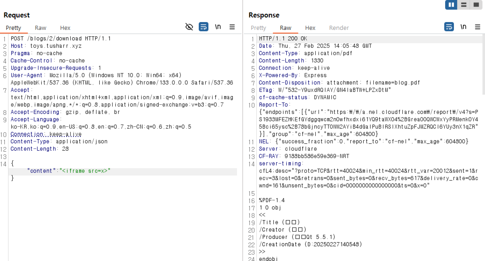
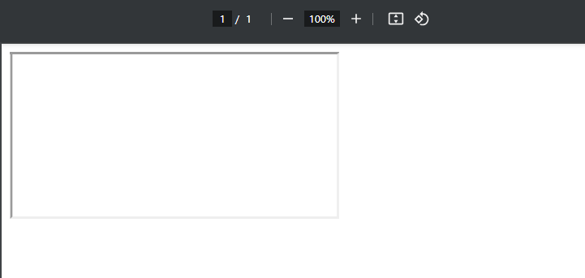
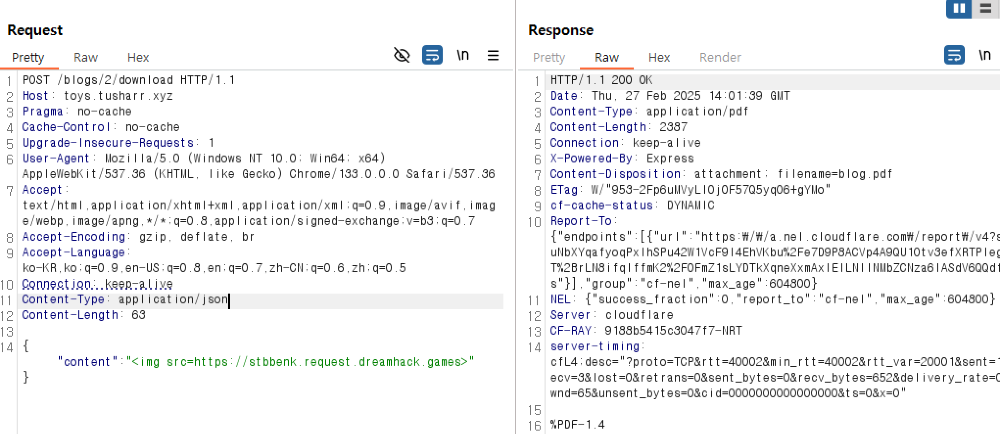
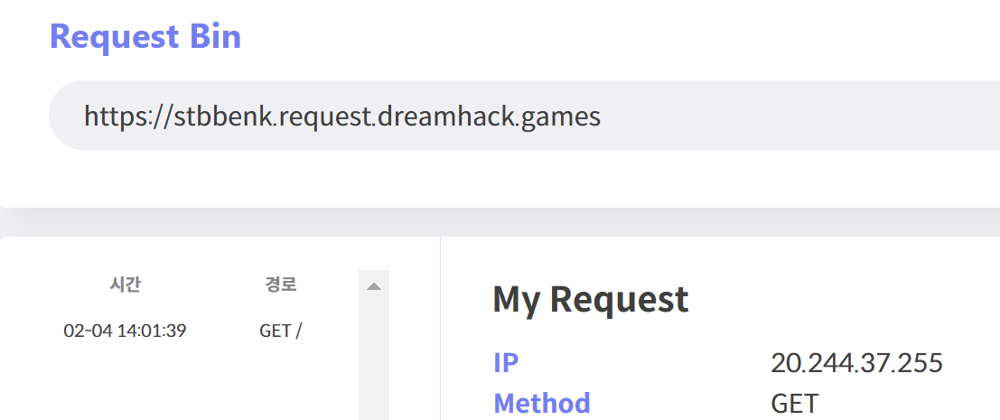
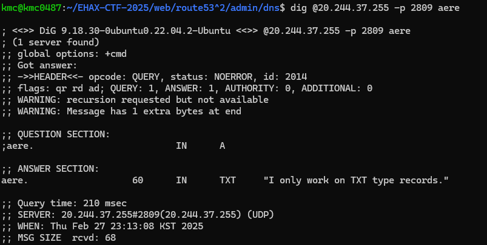
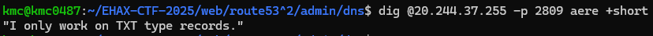
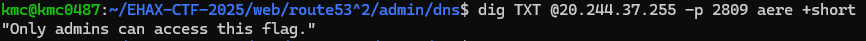
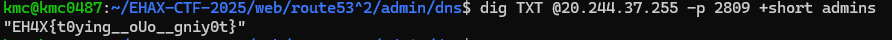

# route\_(53)^2

먼저 문제 서버에서 주어진 url을 들어가면 posts들을 볼 수 있다.
그리고 개발자 도구를 켜서 확인한 script는 다음과 같았다.

```
document.getElementById("download-btn").addEventListener("click", async () => {
    const content = document.getElementById("blog-content");

    const response = await fetch("/blogs/2/download", {
        method: "POST",
        headers: {
            "Content-Type": "application/json"
        },
        body: JSON.stringify({ content: content.innerHTML })
    });

    if (response.ok) {
        const blob = await response.blob();
        const url = window.URL.createObjectURL(blob);
        const a = document.createElement("a");
        a.href = url;
        a.download = "The_Impact_of_Studio_Ghibli_on_Global_Animation.pdf";
        document.body.appendChild(a);
        a.click();
        window.URL.revokeObjectURL(url);
    } else {
        alert("Failed to generate PDF");
    }
});
```

/download를 통해 download할 수 있고 content를 직접 조작이 가능하다.
일단 pdf에 관한 취약점은 많기에 먼저 태그(html)삽입이 가능한지 시험해봤다.




해당 기능을 통해 알아낸점은 두가지 정도가 있다.

1. 응답 헤더 확인시 문제 서버가 특이하게 cloudflare로 동작하는 걸 확인 가능
2. html삽입이 가능하다.

그러면 무엇을 할 수 있을까?

사실 여기서부턴 게싱?이 살짝 필요하다.
일단 문제이름이 Route (53)^2인데 이는 AWS Route 53을 암시한다.
AWS route 53에서 53은 기본 포트를 임의하는데 문제 제목은 (53)^2이라고 하고 있다.
여기서 (53)^2은 포트 53 대신 포트 `(53)^2 = 2809` 에서 실행되는 사용자 지정 DNS 서버를 암시한다.

즉 문제 서버의 2809포트를 찾아야 한다!

먼저 문제 서버의 ip를 알기 위해 pdf파일에 내 서버로 요청 보내는 코드를 삽입해 ip를 알아냈다.




서버의 ip는 20.244.37.255이다.

실제 ip를 알아냈으니 그다음 사용자 지정 DNS서버를 조회해야 한다.

여기선 dig 명령어를 사용할 수 있다.

dig 명령어의 기본적인 옵션은 다음과 같다.

`dig <RECORD_TYPE> @<IP_ADDRESS> -p <PORT> <QUERY>`

- <RECORD_TYPE>: 쿼리할 DNS 레코드 유형(A, TXT 등). 생략하면 기본값으로 A.
- <IP_ADDRESS>: 대상 DNS 서버의 IP입니다.
- -p <PORT>: 포트를 지정합니다(이 경우 2809).
- <QUERY>: 검색할 호스트 이름이나 키워드입니다.

먼저 기본 레코드를 확인해 준다.

`dig @20.244.37.255 -p 2809 +short anything`

여기서 +short 옵션은 짧고 관련성 있는 출력을 위한 옵션이다. 그리고 anything은 일단 기본 레코드 확인을 위해 아무 query나 준 값이다.

아래는 +short 유무에 따른 응답 차이다.

+short 옵션 있을 경우


없을 경우



해당 명령어를 통해 2809포트는 TXT레코드에서만 작동한다는걸 알 수 있다.
TXT 레코드란 DNS에서 문자열 정보를 저장하는 레코드이다.

dig 명령어에서 TXT레코드 조회를 위해선 앞에 TXT만 붙여주면 된다.



그러면 admins만 flag확인이 가능하다고 한다.

admins 확인을 위해 query에 admins를 줘봤다.


FLAG 확인이 가능하다.

`FLAG : EH4X{t0ying__oUo__gniy0t}`
