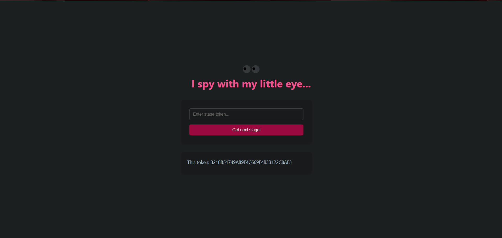
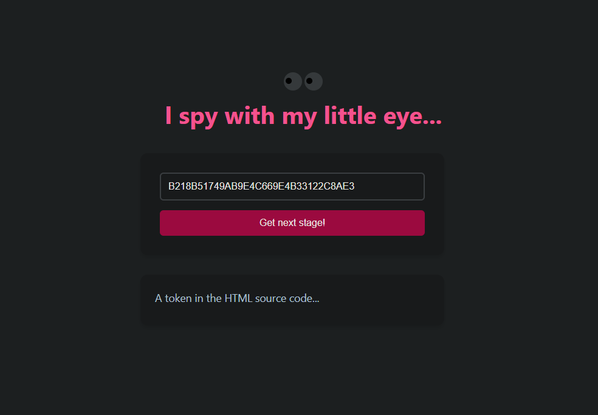
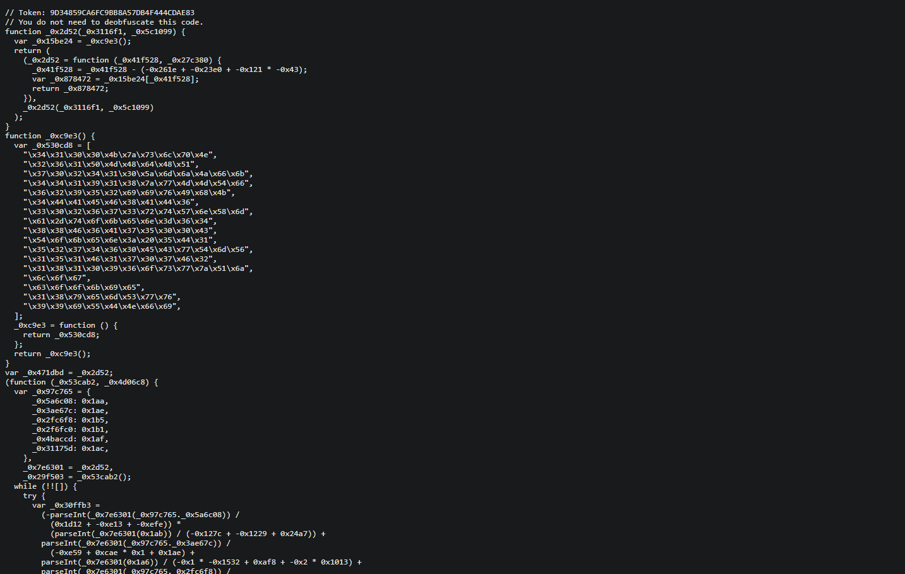
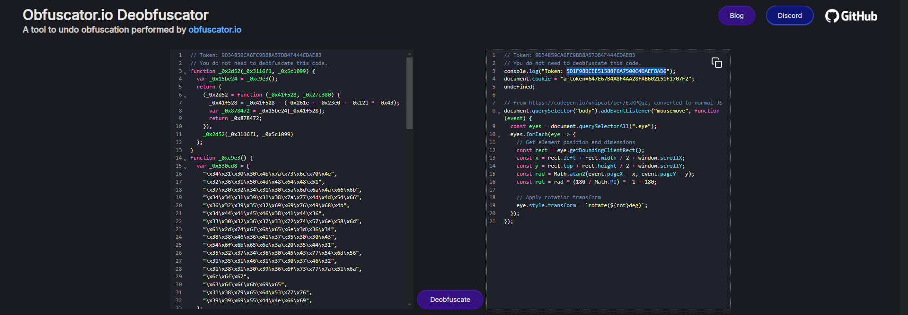
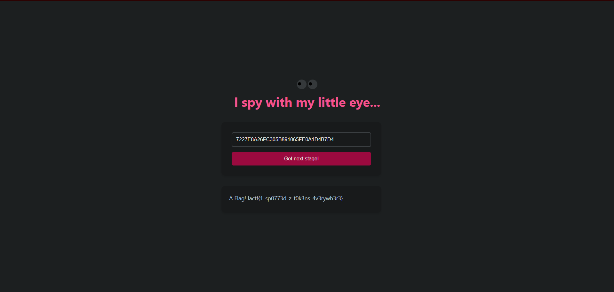

# I spy...

첫 단계는 단순히 token을 넣으면 다음 단계로 넘어간다.

두번째 단계는 html소스에서 찾으라고 되어있는데 주석처리 되어있는 토큰을 넣으면 된다.

`<!-- Token: 66E7AEBA46293C88D484CDAB0E479268 -->`

그다음 세번째 단계는 js코드에서 찾으라고 되어있어서 import되어있는 js 파일을 살펴봤다.

난독화되어있는 소스를 발견할 수 있고

https://deobfuscate.io 사이트를 사용해서 난독화 해제를 해줬다.

세번째 토큰을 발견할 수 있었고 다음 단계로 넘어갔다.

네번째 단계는 stylesheet에 있다고 되어있는데 /style.css에 토큰이 있어 넘겨주었다.

다섯번째 단계는 또 js코드에 있다고 되어있는데 전 js 코드에 다른 토큰도 있어서 이걸 넘겨주었다.

여섯번째 단계는 header에 있다고 한다.

요청 헤더를 살펴보면은 토큰이 있는걸 확인 가능하다.

일곱번째 단계는 쿠키에 있다고 한다.

이것또한 쿠키를 확인하면 찾을 수 있다.

여덟번째 단계는 `A token where the robots are forbidden from visiting..` 여기에 있다고 한다.

이건 /robots.txt에 들어가면 확인 가능하다.

아홉번째 단계는 `A token where Google is told what pages to visit and index...` 여기에 있다고 한다.

google 크롤러는 `/sitemap.xml`을 사용하는데 여기에 가면 토큰을 확인 가능하다.

열번째 단계는 DELETE request를 날리면 된다고 한다.

DELETE request날리면 토큰을 받을 수 있다.

열한번째 단계는 `A token in a TXT record at i-spy.chall.lac.tf...` 이라고 한다.

이건 dig 명령어로

`dig TXT <URL> +short`

이런 형식으로 날리면 토큰을 받아올 수 있고 해당 토큰을 마지막으로 flag를 얻을 수 있었다.

`FLAG : lactf{1_sp0773d_z_t0k3ns_4v3rywh3r3}`
