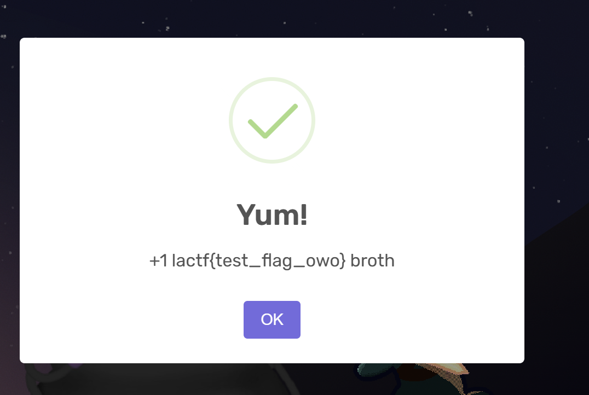

# arclbroth

로그인 / 회원가입 기능이 있고 일반 유저로 로그인 시 arc를 10 받는다.
문제는 flag를 얻으려면 50개의 arc가 있어야 하는데 일반 유저는 최대 arc가 10이므로 불가능하다.

따라서 admin id로 로그인을 해야 하지만 admin 계정은 코드에서 볼 수 있다시피 random값으로 되어있어 거의 알아내기 불간능하다.

```
const adminpw = process.env.ADMINPW ?? crypto.randomBytes(16).toString('hex');
```

또한 register에서도 admin id와 똑같으면 register을 막고 있다.

```
const existing = sql`SELECT * FROM users WHERE username=${username}`;
	if (existing.length > 0) {
		res.status(400).json({ err: 'user already exists' });
		return;
	}
```

그럼 어떻게 우회해야 할까?

답은 sql에 있다.

만약 register에서 id값을 `admin\u0000qwer` 이렇게 주면 어떻게 될까?

```
app.post('/register', (req, res) => {
	const username = req.body.username;
	const password = req.body.password;

	if (!username || typeof username !== 'string') {
		res.status(400).json({ err: 'provide a username owo' });
		return;
	}

	if (!password || typeof password !== 'string') {
		res.status(400).json({ err: 'provide a password uwu' });
		return;
	}

	const existing = sql`SELECT * FROM users WHERE username=${username}`;
	if (existing.length > 0) {
		res.status(400).json({ err: 'user already exists' });
		return;
	}
	console.log(`register : ${username}`);
	sql`INSERT INTO users VALUES (${username}, ${password}, 10)`;
	const id = crypto.randomInt(281474976710655);
	sql`INSERT INTO sessions VALUES (${id}, ${username})`;
	res.cookie('session', id).json({ success: true });
});
```

일단 password 변수에는 `admin\u0000qwer` 값이 담긴 후 existing 변수에서 존재하는 이름인지 검사한다.

그러면 일단 SELECT문에 들어갈땐 admin id와 다르니 우회가 된 후 회원가입까지 성공적으로 될 것이다.

그다음 가져올때가 문제인데 app.use에서 SELECT문을 사용해 username을 갖고오고 있다.

```
app.use((req, res, next) => {
	const sessId = parseInt(req.cookies.session);
	if (!isNaN(sessId)) {
		const sessions = sql`SELECT username FROM sessions WHERE id=${sessId}`;
		if (sessions.length > 0) {
			console.log(sessions[0].username);
			res.locals.user =
				sql`SELECT * FROM users WHERE username=${sessions[0].username}`[0];
		}
		console.log(sql`SELECT COUNT(username) FROM sessions`);
	}
	next();
});
```

그러나 저기 console내용을 확인하면 알다시피 SELECT문으로 가져올때 null문자 뒷 내용이 자연스럽게 삭제되고 admin만 username으로 갖고오는 것을 확인 할 수 있다.

따라서 admin으로의 session 우회가 가능해진다.

정확한 이유는 문제에서 사용되는 `secure-sqlite` 패키지를 디버깅 해봐야 알겠지만 대충 해당 패키지에서 `ffi-napi` 이러한 패키지를 종속하고 있는데 해당 패키지의 secure report를 보면은 대충 C library를 불러오는데 C에서는 `\x00` null문자가 문자의 끝을 의미하므로 뒤에 부분은 끊기게 되는 것이다.

결국 register시에 버프스위트로 잡은 후

```
ID : admin\u0000dummy
PW : dummy
```

이런식으로 회원가입 하면 arc100개 획득이 가능하고 flag도 얻을 수 있다.



결국은 sqlite null byte 취약점이다.

`FLAG : lactf{bulri3v3_it_0r_n0t_s3cur3_sqlit3_w4s_n0t_s3cur3}`
