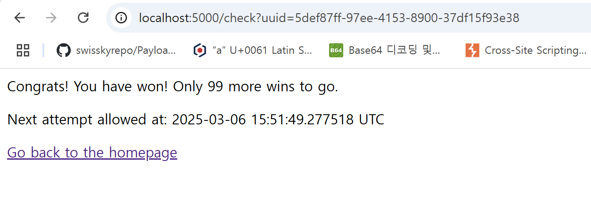
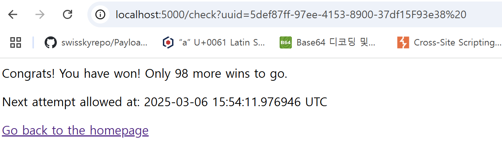

# cache it to win it!



uuid를 할당 받고 100번 이기면 된다.
이기는 조건은 코드를 보면 안다.

```
from flask import Flask, request, jsonify, g, Blueprint, Response, redirect
import uuid
from flask_caching import Cache
import os
import mariadb
import datetime

app = Flask(__name__)

# Configure caching (simple in-memory cache)
app.config["CACHE_TYPE"] = "RedisCache"
app.config["CACHE_REDIS_HOST"] = os.getenv("CACHE_REDIS_HOST", "redis")
app.config["CACHE_DEFAULT_TIMEOUT"] = 604800  # Cache expires in 7 days
cache = Cache(app)


def get_db_connection():
    try:
        conn = mariadb.connect(
            host=os.getenv("DATABASE_HOST"),
            user=os.getenv("DATABASE_USER"),
            password=os.getenv("DATABASE_PASSWORD"),
            database=os.getenv("DATABASE_NAME"),
        )
        return conn
    except mariadb.Error as e:
        return {"error": str(e)}


# I'm lazy to do this properly, so enjoy this ChatGPT'd run_query function!
def run_query(query, params=None):
    conn = get_db_connection()
    if isinstance(conn, dict):
        return conn

    try:
        cursor = conn.cursor(dictionary=True)
        cursor.execute(query, params or ())

        conn.commit()
        result = {
            "success": True,
            "affected_rows": cursor.rowcount,
            "result": cursor.fetchall(),
        }

        return result
    except mariadb.Error as e:
        print("ERROR:", e, flush=True)
        return {"error": str(e)}
    finally:
        cursor.close()
        conn.close()


@app.route("/")
def index():
    if "id" not in request.cookies:
        unique_id = str(uuid.uuid4())
        run_query("INSERT INTO users VALUES (%s, %s);", (unique_id, 0))
    else:
        unique_id = request.cookies.get("id")
        res = run_query("SELECT * FROM users WHERE id = %s;", (unique_id,))
        print(res, flush=True)
        if "affected_rows" not in res:
            print("ERRROR:", res)
            return "ERROR"
        if res["affected_rows"] == 0:
            unique_id = str(uuid.uuid4())
            run_query("INSERT INTO users VALUES (%s, %s);", (unique_id, 0))

    html = f"""
    <!DOCTYPE html>
    <html>
    <head>
        <title>{unique_id}</title>
    </head>
    <body>
        <h1>Your unique account ID: {unique_id}</h1>
        <p><a href="/check?uuid={unique_id}">Click here to check if you are a winner!</a></p>
    </body>
    </html>
    """
    r = Response(html)
    r.set_cookie("id", unique_id)
    return r


def normalize_uuid(uuid: str):
    uuid_l = list(uuid)
    i = 0
    for i in range(len(uuid)):
        uuid_l[i] = uuid_l[i].upper()
        if uuid_l[i] == "-":
            uuid_l.pop(i)
            uuid_l.append(" ")

    return "".join(uuid_l)


def make_cache_key():
    return f"GET_check_uuids:{normalize_uuid(request.args.get('uuid'))}"[:64]  # prevent spammers from filling redis cache


check_bp = Blueprint("check_bp", __name__)


@check_bp.route("/check")
@cache.cached(timeout=604800, make_cache_key=make_cache_key)
def check():
    user_uuid = request.args.get("uuid")
    if not user_uuid:
        return {"error": "UUID parameter is required"}, 400

    run_query("UPDATE users SET value = value + 1 WHERE id = %s;", (user_uuid,))
    res = run_query("SELECT * FROM users WHERE id = %s;", (user_uuid,))
    g.cache_hit = False
    if "affected_rows" not in res:
        print("ERRROR:", res)
        return "Error"
    if res["affected_rows"] == 0:
        return "Invalid account ID"
    num_wins = res["result"][0]["value"]
    if num_wins >= 100:
        return f"""CONGRATS! YOU HAVE WON.............. A FLAG! {os.getenv("FLAG")}"""
    return f"""<p>Congrats! You have won! Only {100 - res["result"][0]["value"]} more wins to go.</p>
    <p>Next attempt allowed at: {(datetime.datetime.now() + datetime.timedelta(days=7)).isoformat(sep=" ")} UTC</p><p><a href="/">Go back to the homepage</a></p>"""


# Hack to show to the user in the X-Cached header whether or not the response was cached
# How in the world does the flask caching library not support adding this header?????
@check_bp.after_request
def add_cache_header(response):
    if hasattr(g, "cache_hit") and not g.cache_hit:
        response.headers["X-Cached"] = "MISS"
    else:
        response.headers["X-Cached"] = "HIT"

    g.cache_hit = True

    return response


app.register_blueprint(check_bp)


# Debugging use for dev - remove before prod
# @app.route("/clear")
# def clear():
#     cache.clear()
#     return "cache cleared!"


if __name__ == "__main__":
    app.run(host="0.0.0.0", port=5000)

```

이건 full 코드이고 봐야될 부분은 check부분이다.

```
def normalize_uuid(uuid: str):
    uuid_l = list(uuid)
    i = 0
    for i in range(len(uuid)):
        uuid_l[i] = uuid_l[i].upper()
        if uuid_l[i] == "-":
            uuid_l.pop(i)
            uuid_l.append(" ")

    return "".join(uuid_l)


def make_cache_key():
    return f"GET_check_uuids:{normalize_uuid(request.args.get('uuid'))}"[:64]  # prevent spammers from filling redis cache


check_bp = Blueprint("check_bp", __name__)


@check_bp.route("/check")
@cache.cached(timeout=604800, make_cache_key=make_cache_key)
def check():
    user_uuid = request.args.get("uuid")
    if not user_uuid:
        return {"error": "UUID parameter is required"}, 400

    run_query("UPDATE users SET value = value + 1 WHERE id = %s;", (user_uuid,))
    res = run_query("SELECT * FROM users WHERE id = %s;", (user_uuid,))
    g.cache_hit = False
    if "affected_rows" not in res:
        print("ERRROR:", res)
        return "Error"
    if res["affected_rows"] == 0:
        return "Invalid account ID"
    num_wins = res["result"][0]["value"]
    if num_wins >= 100:
        return f"""CONGRATS! YOU HAVE WON.............. A FLAG! {os.getenv("FLAG")}"""
    return f"""<p>Congrats! You have won! Only {100 - res["result"][0]["value"]} more wins to go.</p>
    <p>Next attempt allowed at: {(datetime.datetime.now() + datetime.timedelta(days=7)).isoformat(sep=" ")} UTC</p><p><a href="/">Go back to the homepage</a></p>"""
```

이기는건 단순히 요청만 보내면 되지만 문제는 cache를 사용하고 있다.

같은 uuid에 대해 캐싱을 하고 있으므로 죽어라 같은 uuid로 요청을 보내도 결국 1번밖에 이기지 못할 것이다.

여기서 bypass할 방법은 uuid쿼리에 다른 uuid를 주고 서버에선 sql에선 같은 uuid로 인식하게 해야 한다.

내가 쓴 방법은 공백과 널 문자이다.

예를 들어 uuid가 `5def87ff-97ee-4153-8900-37df15F93e38` 이면 uuid 쿼리에 `5def87ff-97ee-4153-8900-37df15F93e38%20` 이렇게 주면 같은 uuid로 MariaDB sql에선 인식하지만 캐시에선 다른 uuid key라고 인식하기에 추가로 이기게 된다.



근데 코드를 보면 알 수 있지만 uuid key를 64글자까지만 잘라서 사용하므로 추가로 넣을 수 있는 공백은 12자 정도 된다.

이때 null문자를 같이 섞어주면 된다.

null문자도 공백처럼 같은 uuid로 인식하므로 사용이 가능하다.

공백과 null 문자를 섞으면 최대 경우의 수가 2^12정도 되는데 이는 100을 한참 넘으므로 충분히 사용 가능하다.

이런식으로 공백과 null문자를 섞어 100번 이기면 FLAG 획득이 가능해진다.

`FLAG : lactf{my_c4ch3_f41l3d!!!!!!!}`
