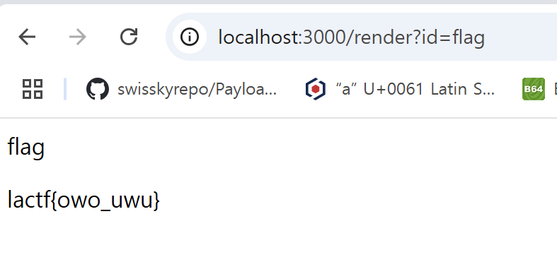

# chessbased

언인텐? 이 있는 문제였는데

```

openings.forEach((op) => (op.premium = false));
openings.push({ premium: true, name: 'flag', moves: flag });

const lookup = new Map(openings.map((op) => [op.name, op]));

app = express();

app.use(cookieParser());
app.use('/', express.static(path.join(__dirname, '../frontend/dist')));
app.use(express.json());

app.get('/render', (req, res) => {
  const id = req.query.id;
  const op = lookup.get(id);
  res.send(`
    <p>${op?.name}</p>
    <p>${op?.moves}</p>
  `);
});

```

해당 소스에서 원래였으면 /render경로에 flag에 관한 필터링이 있어야 했지만 제작자가 깜빡하고 빼먹어서 flag를 바로 얻을 수 있었다.

`/render?id=flag`


