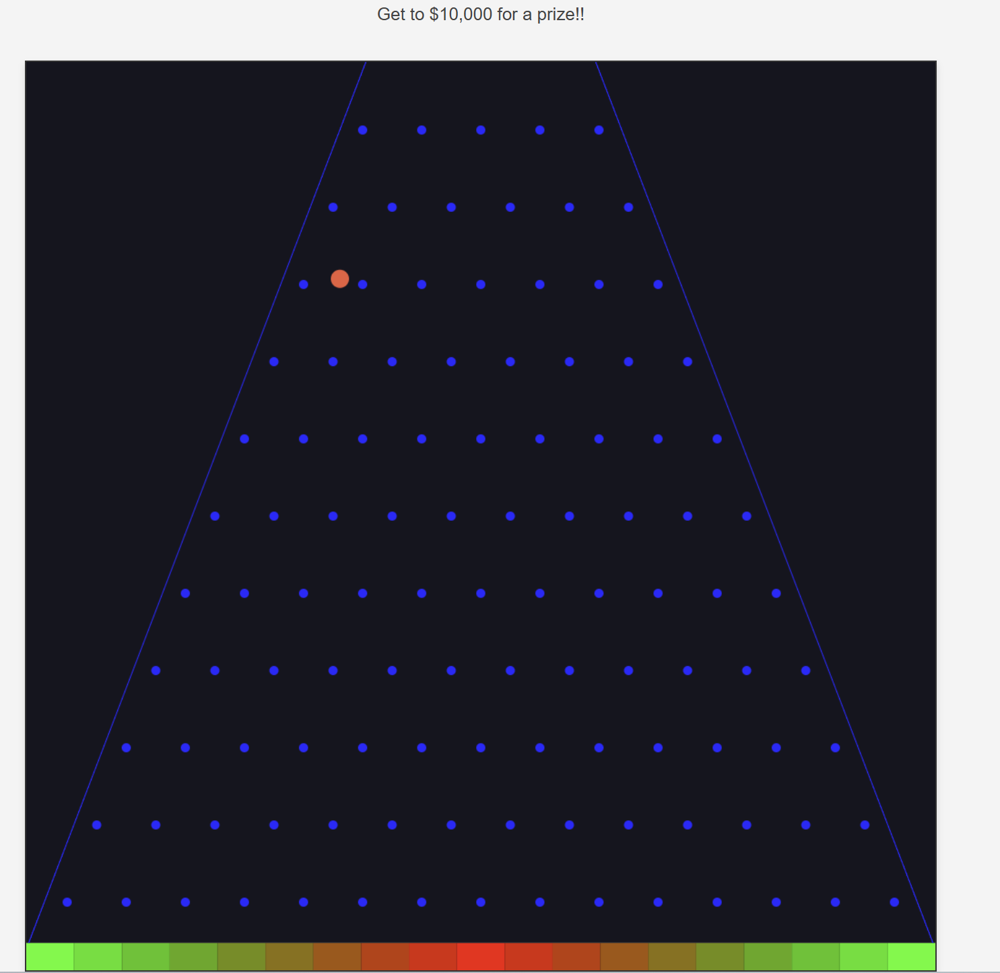
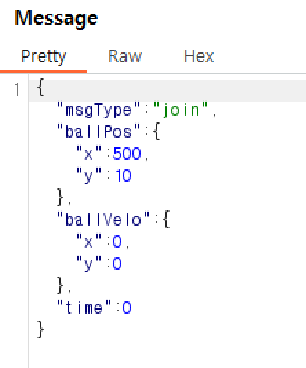
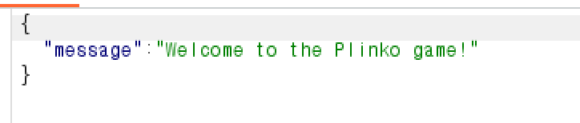
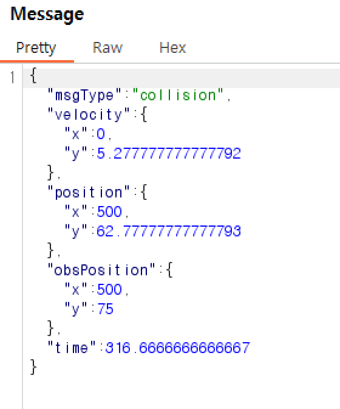
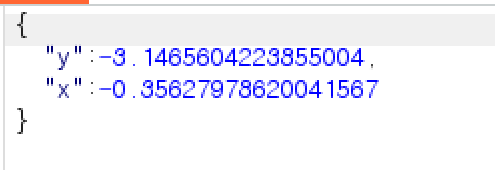
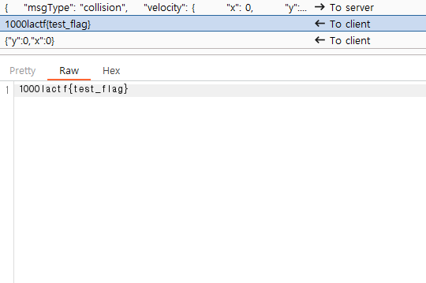

# plinko

ball game이다.



볼이 각 지점에 떨어지고 해당 떨어진 지점을 기준으로 점수를 얻는다.

처음 게임 머니를 1000을 받고 한 게임당 100의 머니가 소요된다.

그리고 각 점수는 코드를 보면 알 수 있는데 대략 0~1000점까지 얻을 수 있다.

```
const multipliers = [
    10.0, 6.24, 3.66, 1.98, 0.95, 0.39, 0.12, 0.02, 0.0015, 0.0,
    0.0015, 0.02, 0.12, 0.39, 0.95, 1.98, 3.66, 6.24, 10.0
  ];
```

그리고 웹소켓으로 통신을 해서 각 장애물 위치, 공의 위치 등을 계산하고 `Math.random()` 을 사용해 볼의 다음 위치를 랜덤하게 계산한다.




처음 시작할 때는 msgType을 join으로 줘서 볼의 처음 위치를 전달한 후 시작한다.

이후 볼이 장애물에 부딪히면 장애물 위치와 볼의 위치를 서버에 전달 후 서버가 그 다음 볼의 움직임을 계산해서 다시 전달해 준다.




그리고 종료 조건은 코드에 나와있다시피 마지막으로 부딪힌 핀의 위치가 x=500&&y=1000이면 된다.

```
if (pinPos.x==500 && pinPos.y==1000) {
        // ground
        let index = Math.floor(ballPos.x/(1000/19));
        if (index<0) index=0;
        if (index>=multipliers.length) index = multipliers.length-1;
        let points = multipliers[index]*100;
        users[req.session['user']].points +=points;
        if (users[req.session['user']].points>10000) socketSend(ws, points+flag, () => ws.close());
        else socketSend(ws, points, () => ws.close());
    }
```

그리고 포인트가 10000이상이면 flag를 준다.

그러면 처음 join할때 볼의 위치를 조정할 수 있을까?

가능하지만 y축만 조정이 가능하다. 왜냐면 처음 x축위치를 검사하고 있기 때문이다.

```
if (msgType=='join') {
    if (msgData.ballPos.x!=500) {
        socketSend(ws, JSON.stringify({error: "Stop cheating"}), () => ws.close());

    }
    prevCollision = msgData.ballPos;
    prevVelo = msgData.ballVelo;
    prevTime = msgData.time;
    if (!req.session.user || !req.session['user'] || !(users[req.session['user']])) {
        socketSend(ws, JSON.stringify({error: "Not logged in"}), () => ws.close());
    }
    else  {
        if (users[req.session['user']].points<100) {
            socketSend(ws, JSON.stringify({error: "Not enough money"}), () => ws.close());
        }
        socketSend(ws, JSON.stringify({ message: 'Welcome to the Plinko game!' }));
        users[req.session['user']].points-=100;
    }
    return;
}
```

그러면 100점 넘는 플레이를 릴레이 하면 되지 않나 싶지만 Math.random으로 위치를 주고 그 위치값이 반영되었는지 검사하기 때문에 릴레이 공격은 못한다.

정답은 충돌 부분에 있다.

처음 위치를 500,1000 으로 설정하고 충돌 시에 포지션을 0, 1000으로 볼을 설정하고 충돌하는 핀 위치도 500,1000으로 위치시키면 볼이 왼쪽 끝에 충돌하는 것으로 인식할 것이다. 그다음 time을 0으로 해주면 코드에서 time에 timeInterval을 곱해서 velocity를 구하고 있는데 0에 무엇을 곱하든 0이 되므로 validate함수도 통과하게 된다.

```
function validatePosition(prevCollision, prevVelo, prevTime, currCollision, currVelo, currTime) {
    if (typeof(prevTime)!=='number' || typeof(currTime)!=='number') return false;
    if (!prevCollision || !prevVelo || !currCollision || !currVelo) return false;
    if (!('x' in prevCollision) || !('y' in prevCollision) || !('x' in prevVelo) || !('y' in prevVelo) || !('x' in currCollision) || !('y' in currCollision) || !('x' in currVelo) || !('y' in currVelo)) return false;
    if (Math.abs(prevVelo.x-currVelo.x)>0.001) {
        return false;
    }
    const t = (currTime-prevTime);
    const posChange = calcPositionDiff(t, prevVelo.y);
    const veloChange = timeInterval*t/1000;

    const newYVelo = veloChange+prevVelo.y;
    const newYPos = posChange+prevCollision.y;

    if (Math.abs(newYVelo-currVelo.y)>0.001) {

        return false;
    }
    if (Math.abs(newYPos-currCollision.y)>0.001) {
        return false;
    }
    return true;
}
```

첫번째 요청

```
{
    "msgType": "join",
    "ballPos": {
        "x": 500,
        "y": 1000
    },
    "ballVelo": {
        "x": 0,
        "y": 0
    },
    "time": 0
}
```

두번째 요청

```
{
    "msgType": "collision",
    "velocity": {
        "x": 0,
        "y": 0
    },
    "position": {
        "x": 0,
        "y": 1000
    },
    "obsPosition": {
        "x": 500,
        "y": 1000
    },
    "time": 0
}
```



1000점을 얻을 수 있고 10번 반복하면 flag획득이 가능하다.

`FLAG : lactf{mY_b4Ll_w3Nt_P1iNk_pL0Nk_4nD_n0W_1m_br0K3}`
