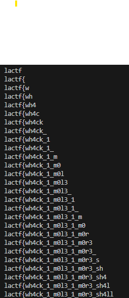

# whack-a-mole

먼저 소스코드는 다음과 같다.

```
from flask import Flask, session, request, redirect, render_template
import os
import random as rng
from cryptography.fernet import Fernet
from flask.sessions import SessionInterface, SecureCookieSessionInterface
from itsdangerous import URLSafeTimedSerializer
from itsdangerous.encoding import base64_decode, base64_encode

flag = os.environ.get("FLAG", "lactf{owo_uwu}")

app = Flask(__name__, static_folder="static")
app.secret_key = os.urandom(32).hex()

key = Fernet.generate_key()
f = Fernet(key)

class EncryptedSerializer(URLSafeTimedSerializer):
    def load_payload(self, payload, *args, serializer = None, **kwargs):
        encrypted = base64_decode(payload)
        decrypted = f.decrypt(encrypted)
        return super().load_payload(decrypted, *args, serializer, **kwargs)

    def dump_payload(self, obj):
        decrypted = super().dump_payload(obj)
        encrypted = f.encrypt(decrypted)
        return base64_encode(encrypted)

# impl yoinked from https://github.com/pallets/flask/blob/f61172b8dd3f962d33f25c50b2f5405e90ceffa5/src/flask/sessions.py#L317
class EncryptedSessionInterface(SecureCookieSessionInterface):
    def get_signing_serializer(self, app):
        if not app.secret_key:
            return None

        keys: list[str | bytes] = [app.secret_key]

        return EncryptedSerializer(
            keys,  # type: ignore[arg-type]
            salt=self.salt,
            serializer=self.serializer,
            signer_kwargs={
                "key_derivation": self.key_derivation,
                "digest_method": self.digest_method,
            },
        )

app.session_interface = EncryptedSessionInterface()


@app.post("/login")
def login():
    name = str(request.form.get("username"))
    funny_num = int(request.form.get("funny"))
    password = bytes((ord(ch) + funny_num) % 128 for ch in flag).decode()
    session["username"] = name
    session["sudopw"] = password
    return redirect("/game")


@app.post("/whack")
def whack():
    if "username" not in session:
        return {"err": "login pls"}

    if session["username"] == session["sudopw"]:
        return {"win": True}

    return {"mole": rng.randrange(5), "win": False}

@app.get("/")
def index():
    return render_template("index.html")

@app.get("/game")
def game():
    if "username" not in session:
        return redirect("/")
    return render_template("game.html", username=session["username"])


if __name__ == "__main__":
    app.run("0.0.0.0", 8000, debug=True)
```

flag를 얻기 위해선 session값을 알아내야 하는데
flask는 flask-unsign 코드를 사용하여 session값 디코딩이 가능하다.
하지만 현재 session인코딩/디코딩하는 클래스를 상속받아 함수를 다르게 변경하고 있다.

해당 코드에서 상속하고 있는 URLSAFETimedSerializer는 아래 깃헙 자료에서 찾을 수 있다.
https://github.com/pallets/itsdangerous/blob/main/src/itsdangerous/url_safe.py

```
def load_payload(
        self,
        payload: bytes,
        *args: t.Any,
        serializer: t.Any | None = None,
        **kwargs: t.Any,
    ) -> t.Any:
        decompress = False

        if payload.startswith(b"."):
            payload = payload[1:]
            decompress = True

        try:
            json = base64_decode(payload)
        except Exception as e:
            raise BadPayload(
                "Could not base64 decode the payload because of an exception",
                original_error=e,
            ) from e

        if decompress:
            try:
                json = zlib.decompress(json)
            except Exception as e:
                raise BadPayload(
                    "Could not zlib decompress the payload before decoding the payload",
                    original_error=e,
                ) from e

        return super().load_payload(json, *args, **kwargs)

    def dump_payload(self, obj: t.Any) -> bytes:
        json = super().dump_payload(obj)
        is_compressed = False
        compressed = zlib.compress(json)

        if len(compressed) < (len(json) - 1):
            json = compressed
            is_compressed = True

        base64d = base64_encode(json)

        if is_compressed:
            base64d = b"." + base64d

        return base64d
```

위에가 URLSafeTimedSerializer가 상속하고 있는 URLSafeSerializerMixin의 load_payload와 dump_payload이다. 해당 함수들은 각각 EncryptedSerializer에서 super()를 통해 호출되었을때 실행된다.

즉, 원래와 다른점은 Ferent를 통해 한번 encrypt하고 base64 encode를 한번 더 한 후 원래 load_payload를 통해 암호화하는 점이다.

이렇게 되면 Ferent의 key를 알고 있지 않아 사실상 불가능 처럼 보이지만 문제는 URLSafeSerializerMixin의 함수들에 있다.

기존의 load_payload는 zlib copmpress를 사용하고 있다.

zlib compress는 원래와 비슷한 문장들이 있으면 엔트로피가 높아지는 성향이 있기에 압축률이 올라간다.

예를들어 asdfasdfasdfasdf와 gqnrdanfisdnofno의 압축률은 반복이 많은 전자가 더 높다.

따라서 username을 flag와 비슷한 값으로 놓으면은 압축률이 높아져 암호화된 길이가 짧아질 것이기에 이 방법을 통해 flag를 한글자씩 유추 가능하다.

아래가 solve 코드이다.

```
import string

import requests
from tqdm import tqdm

base = "http://localhost:8000"
# base = "https://whack-a-mole.chall.lac.tf/"
url = lambda end: f"{base.rstrip('/')}{end}"

alpha = string.ascii_letters + string.digits + "{}_"
rng = "fdhbifnhpwot4" # 패딩용 아무거나

s = requests.Session()


def get_len(guess):
    r = s.post(
        url("/login"),
        data={"username": guess, "funny": "0"},
        allow_redirects=False,
    )
    sess = s.cookies["session"]
    return len(sess)


prefix = "lac"
block_size = 16
padrange = [*range(block_size)]

while "}" not in prefix:
    for pad in [*padrange]:
        # print(pad)
        owos = []
        for ch in alpha:
            guess = (prefix + ch) * block_size
            # print(guess)
            guess = guess + rng[:pad]
            # print(guess)
            owos.append((get_len(guess), ch))

        owos.sort()

        if owos[0][0] != owos[1][0]:
            print(owos)
            prefix += owos[0][1]
            padrange.sort(key=lambda x: -1 if x == pad else x) # 앞으로 다시 옮김
            break
    print(prefix)

```

먼저 4글자 단위로 찾고 있는데 이는, base64가 4글자씩 인코딩하는 성질이 있기 때문이다.
그래서 4글자 단위로 확인하는게 zlib 압축 효과를 보기엔 좋다.

그리고 padrange를 통해 padding을 하고 있는데 rng(그냥 아무 임시 문자)를 사용해 패딩을 넣음으로써 zlib 압축률이 달라지게 해서 달라지는 타이밍을 잡으면 된다.
즉, 그냥 더미 문자열을 넣어서 zlib 압축률의 변화가 있을때까지 관찰하는 것이다.

또한, block_size를 16으로 놓고 있는데 이는 AES블록 크기가 16바이트이기 때문이고 16번 반복하면 세션 암호화 구조를 그대로 유지하면서 압축 길이 변화를 관측이 가능하다.

이렇게 패딩값을 조정해가면서 찾아보면 길이가 달라지는 부분이 나올것이고, 길이가 더 짧은 부분이 flag에 속하는 문자임을 유추해낼 수 있다.


